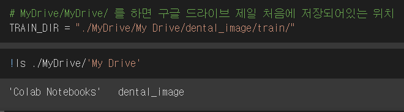

> GOOGLE COLAB에서 GOOGLE DRIVE에 있는 파일 불러오는 방법

구글 코랩에 드라이브를 mount 해준다

하이퍼링크를 클릭한다

코드를 복붙하고 위에 'Enter your authorization code'에 붙여넣는다

Mounted at 성공

어떤 것들이 있는지 확인

코랩설정

수정 - 노트설정 - 하드웨어 가속기 - GPU

